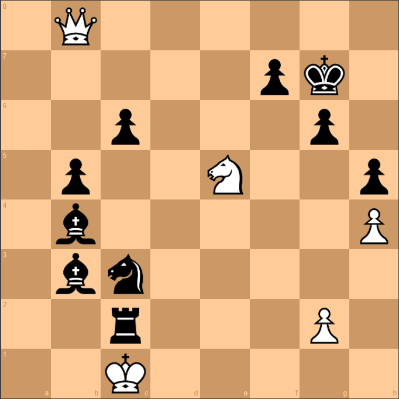
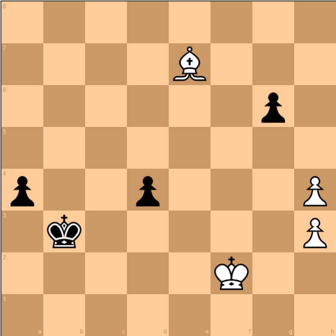

# Jugadas Legendarias

El ajedrez tiene momentos donde la lógica parece romperse y surge la magia. Aquí analizamos tres movimientos que pasaron a la historia.

!!! quote "Mikhail Tal, campeón mundial"
    "Hay dos tipos de sacrificios: los correctos y los míos." — El ajedrez no es solo cálculo, también es arte, intuición y valentía.

---

## 1. El Sacrificio del Siglo (1956)

**Partida:** Donald Byrne vs. Bobby Fischer  
**Lugar:** Nueva York, Estados Unidos  
**Jugada clave:** 17...Be6!! (Sacrificio de Dama)



### Análisis Completo

=== "Contexto"

    ### La Situación
    
    - **Bobby Fischer** tenía solo **13 años**
    - Jugaba con piezas negras contra **Donald Byrne**, un maestro respetado
    - La partida se jugó en el **Rosenwald Memorial Tournament** de 1956
    - Fischer ya estaba en una posición complicada en el medio juego
    
    ### El Momento Crítico
    
    En la jugada 17, Fischer tenía su dama atacada y parecía estar en problemas. Cualquier jugador normal habría movido la dama a un lugar seguro.
    
    **Pero Fischer no era un jugador normal.**

=== "La Idea Clave"

    ### ¿Por qué sacrificar la Dama?
    
    Fischer vio algo que Byrne no había anticipado:
    
    1. **Coordinación perfecta**: Al sacrificar la dama, Fischer activaba sus dos alfiles y su torre en una batería mortal
    2. **Rey expuesto**: El rey blanco quedaba atrapado en el centro del tablero sin escapatoria
    3. **Compensación material**: Aunque perdía la dama (9 puntos), ganaba torre + alfil + peones y un ataque imparable
    
    !!! tip "Principio táctico: Ataque doble"
        Después del sacrificio, Fischer creó múltiples amenazas simultáneas que Byrne no podía defender todas a la vez. Este es el concepto de **sobrecarga** de las piezas defensivas.

=== "El Error del Rival"

    ### ¿Qué falló en la defensa de Byrne?
    
    Donald Byrne cometió varios errores:
    
    1. **Jugada 11**: Desarrolló sus piezas de forma descoordinada
    2. **Jugada 14**: No enrocó a tiempo, dejando su rey en el centro
    3. **Jugada 17**: Aceptó el sacrificio de dama sin calcular las consecuencias
    
    !!! warning "Lección defensiva"
        Cuando tu rey está en el centro y el rival tiene piezas activas, **NO aceptes sacrificios** sin calcular al menos 5 jugadas adelante. La codicia material puede ser fatal.

=== "Qué Aprender"

    ### Lecciones de esta partida
    
    1. **La edad no importa**: Fischer demostró que el talento y la preparación superan la experiencia
    2. **Material vs. Actividad**: A veces, tener menos piezas pero mejor coordinadas es superior a tener más material
    3. **Valentía calculada**: Los grandes sacrificios requieren cálculo preciso, no solo intuición
    4. **Seguridad del rey**: Un rey expuesto es la debilidad más grave en ajedrez
    
    !!! success "Para tu juego"
        Antes de aceptar un sacrificio del rival, pregúntate: *"¿Qué compensación obtiene mi oponente? ¿Puede crear amenazas más rápido de lo que yo puedo defender?"*

??? question "¿Quieres ver la secuencia completa?"

    ### Continuación tras 17...Be6!!
    
    Después del sacrificio de dama, la partida continuó:
    
    ```
    18. Bxb6  Bxc3+     (El alfil da jaque, forzando al rey a moverse)
    19. Kd1   axb6      (Fischer recupera el alfil)
    20. Qb4   Ra4!      (La torre entra al ataque con tempo)
    21. Qxb6  Nxd4      (El caballo se une a la fiesta)
    22. Qb5+  Nxb5      (Forzando cambios favorables)
    23. Re1   Rd2+      (Jaque doble demoledor)
    24. Kc1   Rxd3!!    (Otro sacrificio brillante)
    25. Rxd3  Bb2+      (El alfil da el golpe de gracia)
    26. Kc2   Ba3+      (Jaque continuo)
    27. Kb1   Bb2+      (Repetición forzada)
    ```
    
    Byrne se rindió aquí. El rey blanco no tenía escapatoria y Fischer tenía ventaja material decisiva.
    
    **Resultado:** 0-1 (Victoria de Fischer con negras)

---

## 2. El Final Imposible de Shirov (1998)

**Partida:** Veselin Topalov vs. Alexei Shirov  
**Lugar:** Linares, España  
**Jugada clave:** 47...Bh3!! (Sacrificio de alfil)



### Análisis Completo

=== "Contexto"

    ### La Situación
    
    - **Linares 1998** era el torneo más fuerte del mundo en ese momento
    - La partida había llegado a un **final de partida** (pocas piezas en el tablero)
    - La posición parecía un **empate técnico** según las computadoras de la época
    - Shirov tenía piezas negras y buscaba desesperadamente ganar
    
    ### El Problema
    
    En finales de partida, cada **tempo** (turno) cuenta. Shirov necesitaba que su rey llegara a una casilla crítica antes que el rey blanco, pero parecía imposible.

=== "La Idea Clave"

    ### El Concepto de "Zugzwang"
    
    Shirov descubrió un concepto profundísimo:
    
    1. **Sacrificio paradójico**: Regaló su alfil en h3, aparentemente sin sentido
    2. **Pérdida de tempo calculada**: Al forzar a las blancas a capturar, perdió un tiempo deliberadamente
    3. **Geometría del tablero**: Cuatro jugadas después, su rey llegaba a la casilla clave **un tempo antes** que el rey blanco
    
    !!! info "¿Qué es Zugzwang?"
        Es una situación donde **tener que mover es una desventaja**. Shirov forzó a Topalov a estar en zugzwang en el momento crítico.

=== "El Error del Rival"

    ### ¿Por qué Topalov no pudo defenderse?
    
    No fue realmente un error de Topalov, sino una **obra maestra** de Shirov:
    
    - Las computadoras de 1998 **no encontraban** esta jugada
    - Requería calcular **más de 10 jugadas** con precisión absoluta
    - La idea era tan antinatural que incluso los grandes maestros la pasaron por alto
    
    !!! quote "Garry Kasparov sobre esta jugada"
        "Esta es la jugada más profunda que he visto en mi vida. Shirov vio algo que las máquinas no podían comprender."

=== "Qué Aprender"

    ### Lecciones de esta partida
    
    1. **Los finales son ciencia**: Requieren cálculo exacto, no intuición
    2. **Sacrificios posicionales**: No todos los sacrificios buscan ataque inmediato; algunos buscan ventajas sutiles
    3. **Tempo es material**: En finales, llegar un turno antes puede valer más que una pieza
    4. **Humildad ante la complejidad**: Incluso las computadoras tienen límites
    
    !!! success "Para tu juego"
        En finales de partida, **cuenta los tempos** como cuentas el material. Pregúntate: *"¿Quién llega primero a la casilla crítica?"*

??? question "¿Por qué las computadoras no lo vieron?"

    ### El Horizonte de Cálculo
    
    Las computadoras de 1998 calculaban aproximadamente **12-15 jugadas** de profundidad en posiciones complejas.
    
    El sacrificio de Shirov requería ver **más de 20 jugadas** adelante con múltiples variantes. La jugada 47...Bh3!! parecía un error según la evaluación a corto plazo.
    
    **Hoy en día**, motores modernos como Stockfish 16 o AlphaZero **sí encuentran** esta jugada, pero solo después de analizar durante varios minutos.
    
    Shirov lo calculó **en su cabeza** durante la partida. Increíble.

---

## 3. La Inmortal de Kasparov (1999)

**Partida:** Garry Kasparov vs. Veselin Topalov  
**Lugar:** Wijk aan Zee, Países Bajos  
**Jugada clave:** 24. Rxd4!! (Sacrificio de Torre)


### Análisis Completo

=== "Contexto"

    ### La Situación
    
    - **Kasparov** era el campeón mundial en activo
    - **Topalov** era uno de los mejores jugadores del mundo (futuro campeón mundial)
    - El torneo de **Wijk aan Zee** es conocido como "el Wimbledon del ajedrez"
    - La partida ya era complicadísima con ambos reyes expuestos
    
    ### El Caos en el Tablero
    
    En la jugada 24, había **piezas atacando por todos lados**. Ambos jugadores estaban en un ataque mutuo donde el primero en dar jaque mate ganaría.

=== "La Idea Clave"

    ### La Cacería del Rey
    
    Kasparov vio una secuencia de **más de 15 jugadas** que forzaba al rey negro a salir de su escondite:
    
    1. **Sacrificio de torre**: Rxd4!! obligaba al rey a capturar o moverse
    2. **Jaque continuo**: Cada jugada de Kasparov era un jaque o una amenaza de mate
    3. **Rey en el centro**: El rey negro fue forzado a caminar desde g8 hasta d3 (¡casi todo el tablero!)
    4. **Mate artístico**: El rey murió en territorio enemigo, rodeado de sus propias piezas
    
    !!! tip "Principio táctico: Ataque al rey expuesto"
        Cuando el rey enemigo está sin defensas, **todos los sacrificios** están justificados si conducen a jaque mate o ventaja decisiva.

=== "El Error del Rival"

    ### ¿Dónde falló Topalov?
    
    Topalov jugó **casi perfectamente** hasta ese momento:
    
    1. **Jugada 19**: Aceptó un sacrificio de peón que parecía ganador
    2. **Jugada 22**: Su rey quedó ligeramente expuesto, pero parecía defendible
    3. **Jugada 24**: No tuvo opción real; todas las alternativas perdían
    
    !!! warning "La trampa de la codicia"
        Topalov aceptó material extra en las jugadas anteriores, pero cada pieza ganada **descoordinaba** su posición. A veces, rechazar material es la mejor defensa.

=== "Qué Aprender"

    ### Lecciones de esta partida
    
    1. **Cálculo profundo**: Kasparov calculó más de 15 jugadas en una posición caótica
    2. **Intuición + cálculo**: La intuición sugirió el sacrificio; el cálculo lo confirmó
    3. **Ataque vs. Defensa**: En posiciones de ataque mutuo, la iniciativa lo es todo
    4. **Belleza del ajedrez**: Esta partida ganó el premio a la "Mejor partida del año"
    
    !!! success "Para tu juego"
        Cuando ambos reyes están expuestos, **ataca primero**. El jugador que da el primer jaque suele ganar. No te pongas a la defensiva en posiciones de ataque mutuo.

??? question "¿Por qué se llama 'La Inmortal'?"

    ### El Nombre Histórico
    
    En ajedrez, las partidas excepcionales reciben nombres especiales:
    
    - **"La Inmortal"** original fue jugada por Adolf Anderssen en 1851
    - **"La Siempreviva"** también fue de Anderssen en 1852
    - **"La Inmortal de Kasparov"** (1999) se considera la versión moderna
    
    ### ¿Por qué es tan especial?
    
    1. **Complejidad**: 67 jugadas de complejidad extrema
    2. **Múltiples sacrificios**: Kasparov sacrificó peones, piezas menores y torre
    3. **Belleza estética**: El rey negro caminando hacia su muerte es visualmente impresionante
    4. **Nivel de los jugadores**: Ambos eran top 5 mundial
    
    **Dato curioso:** Las computadoras de 1999 evaluaban la posición como "empate" hasta la jugada 20. Kasparov vio más allá que las máquinas.

---

## Reflexión Final

Estas tres partidas demuestran que el ajedrez es mucho más que cálculo:

- **Fischer** nos enseñó que la **valentía** y la preparación no tienen edad
- **Shirov** nos mostró que la **profundidad** de pensamiento supera a la tecnología
- **Kasparov** nos demostró que la **intuición artística** combinada con cálculo preciso crea obras maestras

!!! quote "Bobby Fischer"
    "El ajedrez es la vida." — Estas partidas son prueba de que el ajedrez puede ser arte, ciencia y guerra al mismo tiempo.

---

## Siguiente Paso

¿Quieres jugar partidas como estas?

1. **Practica táctica** diariamente en [Lichess.org](https://lichess.org) o Chess.com
2. **Estudia tus partidas** con un motor de ajedrez para encontrar tus errores
3. **Aprende de los maestros** viendo análisis de partidas clásicas
4. **Visita** [Enlaces](enlaces.md) para encontrar más recursos de aprendizaje


