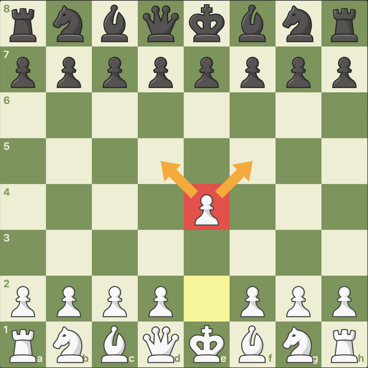
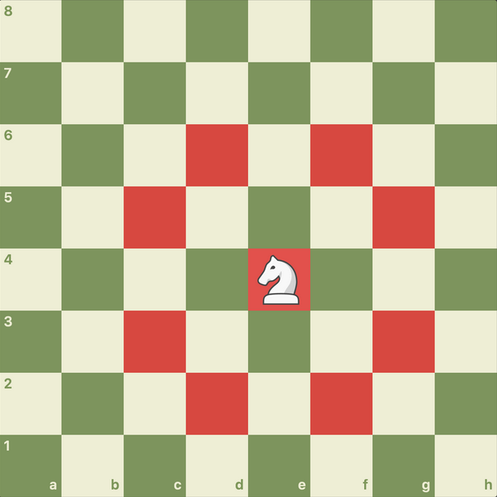
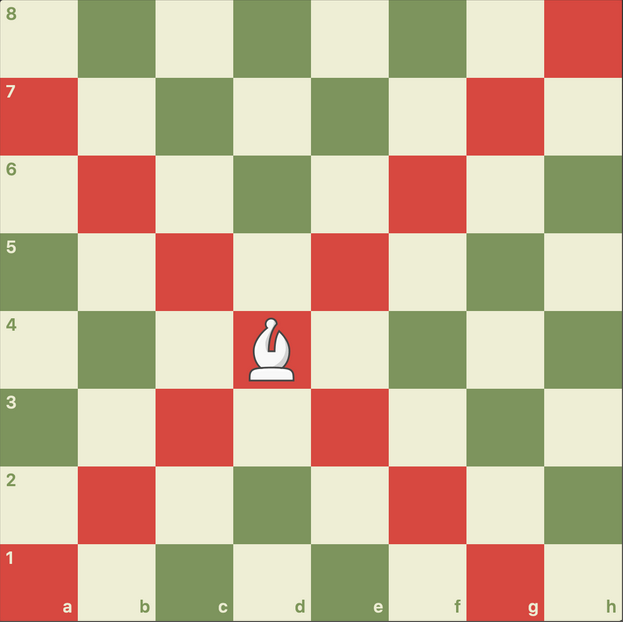
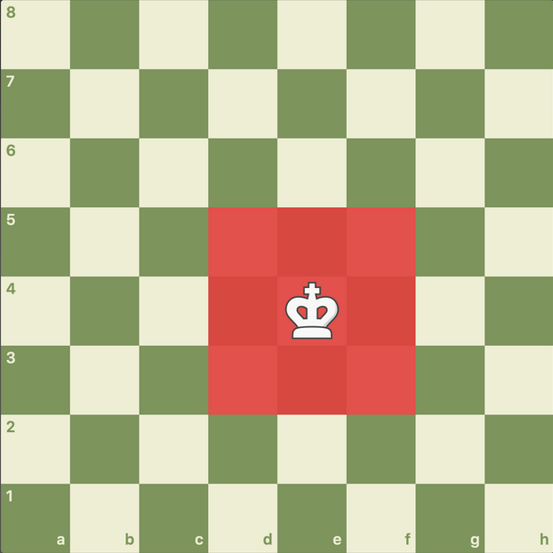

# Movimiento de las Fichas

El ajedrez cuenta con 6 tipos de piezas distintas. Entender cómo se mueve cada una es el primer paso para dominar el juego.

!!! tip "Consejo de aprendizaje"
    La mejor forma de memorizar los movimientos es **jugando partidas reales**. No te preocupes por ganar al principio, enfócate en mover correctamente cada pieza.

---

## Aprende Cada Pieza en Detalle

Haz clic en cada pieza para descubrir sus secretos:

??? info "El Peón - La Infantería del Tablero"

    ### Características Básicas
    Es la unidad básica y la más numerosa (8 por jugador).
    
    **Movimiento:**
    
    - Avanza **una casilla hacia adelante**, pero nunca puede retroceder
    - **Excepción:** En su primer movimiento, puede avanzar **dos casillas** de golpe si lo desea
    
    **Captura:**
    
    - A diferencia de cómo mueve, el peón captura en **diagonal** (una casilla hacia adelante a la izquierda o derecha)
    
    
    
    ### Pista Táctica
    
    ??? question "¿Cuándo es mejor avanzar dos casillas con el peón?"
        
        **Respuesta:** Cuando quieres controlar el centro rápidamente o cuando necesitas abrir líneas para tus piezas mayores (torres y dama). Sin embargo, ten cuidado: avanzar dos casillas puede dejar debilidades en tu posición.
    
    ### Regla de Oro
    
    !!! warning "¡Nunca subestimes al peón!"
        Los peones son la **única pieza que puede promocionar** (convertirse en Dama, Torre, Alfil o Caballo) al llegar al otro lado del tablero. Un peón pasado en la séptima fila puede valer más que una pieza menor.

??? info "La Torre - El Cañón Lineal"

    ### Características Básicas
    Pieza sólida y lineal. Comienzas con 2 torres en las esquinas.
    
    **Movimiento:**
    
    - Se mueve en **línea recta** tantas casillas como quiera
    - Puede moverse **horizontal o verticalmente**
    - **Limitación:** No puede saltar por encima de otras piezas
    
    
    
    ### Pista Táctica
    
    ??? question "¿Dónde es más poderosa la torre?"
    
        **Respuesta:** En **columnas abiertas** (columnas sin peones) y en la **séptima fila** (la segunda fila del rival), donde puede atacar peones y restringir al rey enemigo.
    
    ### Valor Relativo
    
    Una torre vale aproximadamente **5 puntos** (equivalente a un alfil + dos peones, o un caballo + dos peones).

??? info "El Caballo - El Saltador Mágico"

    ### Características Básicas
    La pieza más tramposa y única. Comienzas con 2 caballos.
    
    **Movimiento:**
    
    - Se mueve en forma de **"L"**: dos casillas en una dirección y luego una casilla en ángulo de 90 grados
    - **Habilidad especial:** Es la **única pieza** que puede **saltar** por encima de otras piezas (propias o rivales)
    
    
    
    ### Pista Táctica
    
    ??? question "¿Cuál es la mejor casilla para un caballo?"
    
        **Respuesta:** En el **centro del tablero** (especialmente en e5, d5, e4, d4), donde puede controlar hasta **8 casillas**. En el borde del tablero, solo controla 2-4 casillas. Recuerda el dicho: *"Caballo en el borde, partida que se pierde"*.
    
    ### Valor Relativo
    
    Un caballo vale aproximadamente **3 puntos**, similar al alfil, aunque su valor aumenta en posiciones cerradas (con muchos peones bloqueados).

??? info "El Alfil - El Señor de las Diagonales"

    ### Características Básicas
    El señor de las diagonales. Comienzas con 2 alfiles (uno de casillas blancas y otro de negras).
    
    **Movimiento:**
    
    - Se mueve en **diagonal** tantas casillas como quiera
    - **Regla de oro:** Un alfil **nunca puede cambiar de color** de casilla; si empieza en blanca, morirá en blanca
    
    
    
    ### Pista Táctica
    
    ??? question "¿Qué es la 'pareja de alfiles'?"
    
        **Respuesta:** Tener **ambos alfiles** (uno de casillas blancas y otro de negras) mientras tu rival ha cambiado uno. La pareja de alfiles es muy poderosa en posiciones abiertas porque controlan todas las casillas del tablero.
    
    ### Valor Relativo
    
    Un alfil vale aproximadamente **3 puntos**, pero en posiciones abiertas puede valer más que un caballo (3.5 puntos).

??? info "La Dama (Reina) - La Pieza Suprema"

    ### Características Básicas
    La pieza más poderosa del tablero.
    
    **Movimiento:**
    
    - Combina los poderes de la **Torre** y el **Alfil**
    - Puede moverse en línea recta **o** en diagonal
    - Tantas casillas como quiera en **cualquier dirección**
    
    
    
    ### Pista Táctica
    
    ??? question "¿Cuándo debo desarrollar mi dama?"
    
        **Respuesta:** **No saques la dama demasiado pronto**. En la apertura, es mejor desarrollar primero caballos y alfiles. Si sacas la dama temprano, tu rival puede atacarla con piezas menores, ganando tiempo (tempos) en el desarrollo.
    
    ### Valor Relativo
    
    !!! warning "¡Cuida tu dama!"
        La dama vale aproximadamente **9 puntos**. Perderla sin compensación suele significar perder la partida. Es tu mejor arma de ataque, ¡pero también tu mayor responsabilidad!

??? info "El Rey - El Objetivo Final"

    ### Características Básicas
    La pieza más importante, pero no la más fuerte.
    
    **Movimiento:**
    
    - Puede moverse solo **una casilla** en cualquier dirección (horizontal, vertical o diagonal)
    - **Objetivo:** Si el rey es atrapado y no puede escapar (**Jaque Mate**), la partida termina
    
    
    
    ### Pista Táctica
    
    ??? question "¿El rey puede atacar?"
    
        **Respuesta:** ¡Sí! En el **final de partida** (cuando quedan pocas piezas), el rey se convierte en una pieza activa muy importante. Debe participar en el ataque y ayudar a promocionar peones. El rey vale aproximadamente **4 puntos** en el final.
    
    ### Movimiento Especial: El Enroque
    
    !!! info "Enroque - Protege a tu rey"
        El **enroque** es el único movimiento donde mueves dos piezas a la vez (rey y torre). Sirve para poner al rey en seguridad y activar la torre. Hay dos tipos:
        
        - **Enroque corto** (O-O): El rey se mueve dos casillas hacia la torre del lado del rey
        - **Enroque largo** (O-O-O): El rey se mueve dos casillas hacia la torre del lado de la dama

---

## Mini Test: ¿Has Aprendido los Movimientos?

Pon a prueba tus conocimientos con estas preguntas:

### Pregunta 1: ¿Qué pieza puede saltar sobre otras?

=== "A) La Dama"

    **Incorrecto.** La dama es muy poderosa, pero no puede saltar por encima de otras piezas. Necesita líneas despejadas para moverse.

=== "B) El Caballo"

    **¡Correcto!** El caballo es la única pieza que puede saltar por encima de otras piezas (propias o enemigas). Esta habilidad lo hace especialmente útil en posiciones cerradas.

=== "C) El Alfil"

    **Incorrecto.** El alfil se mueve en diagonal, pero necesita diagonales libres. No puede saltar.

=== "Explicación"

    El movimiento en "L" del caballo le permite saltar por encima de cualquier pieza. Esto lo convierte en una pieza táctica muy peligrosa, especialmente en aperturas cerradas donde otras piezas están bloqueadas.

---

### Pregunta 2: ¿Cuántas casillas puede controlar un caballo en el centro del tablero?

=== "A) 4 casillas"

    **Incorrecto.** Un caballo en el borde del tablero controla 4 casillas o menos, pero en el centro es mucho más poderoso.

=== "B) 8 casillas"

    **¡Correcto!** Un caballo perfectamente centralizado (por ejemplo, en e4 o d5) puede controlar hasta 8 casillas diferentes. Por eso es tan importante centralizar tus caballos.

=== "C) 6 casillas"

    **Incorrecto.** Estás cerca, pero un caballo bien centralizado puede controlar 8 casillas, no 6.

=== "Explicación"

    La posición del caballo afecta dramáticamente su poder. En el centro: 8 casillas. En el borde: 2-4 casillas. De ahí el famoso dicho: *"Caballo en el borde, partida que se pierde"*.

---

### Pregunta 3: ¿Cuál es la pieza más valiosa después de la dama?

=== "A) La Torre"

    **¡Correcto!** La torre vale aproximadamente 5 puntos, siendo la segunda pieza más valiosa después de la dama (9 puntos). Dos torres pueden ser incluso más fuertes que una dama en algunos finales.

=== "B) El Alfil"

    **Incorrecto.** El alfil vale aproximadamente 3 puntos, menos que la torre (5 puntos).

=== "C) El Caballo"

    **Incorrecto.** El caballo vale aproximadamente 3 puntos, similar al alfil pero menos que la torre.

=== "Explicación"

    **Escala de valores aproximados:**
    
    - Peón = 1 punto
    - Caballo = 3 puntos
    - Alfil = 3 puntos (3.5 en posiciones abiertas)
    - Torre = 5 puntos
    - Dama = 9 puntos
    - Rey = ¡Infinito! (perderlo = perder la partida)

---

## Siguiente Paso

Ahora que dominas el movimiento de las piezas, es momento de:

1. **Practicar:** Juega partidas contra la computadora en [Lichess.org](https://lichess.org)
2. **Estudiar historia:** Descubre cómo evolucionó el ajedrez en [Historia del Ajedrez](historia.md)
3. **Ver jugadas legendarias:** Analiza partidas maestras en [Jugadas Legendarias](famosas.md)